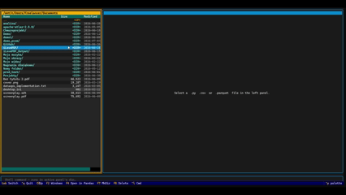

# Pandas Commander
Lightweight Pandas data multitool

## Features
- Classic commander file manager (mkdir , new file , delete, open csv/json as panda script - panda code generation)
- Pandas files editor (view, edit, syntax highlighting , code autocompletion, running)
- Polars files editor (view, edit, syntax highlighting , code autocompletion, running)
- Python files editor (view, edit, syntax highlighting , code autocompletion, running)
- Handy clasic command line with output in window 
- SQL files editor (read, write, syntax highlighting)
- Autosave
- Multiple windows handling
- Results graphical visualisation
- CSV / JSON file viewer / editor

Stay tuned .. there will be more

# Installation guide

```
cd pandas-commander \
python3 -m venv pandascom \
pip install -r requirements.txt
```

# Run

```
source pandascom/bin/activate \
python3 pandas-commander.py
```

## Demo:
